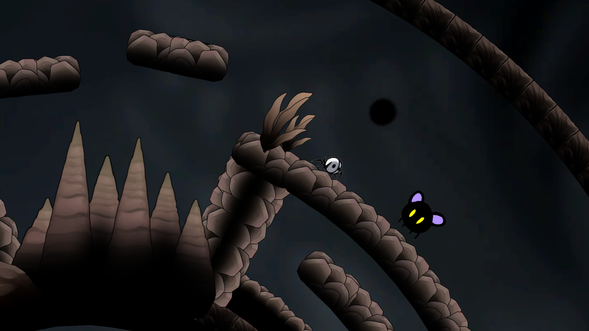
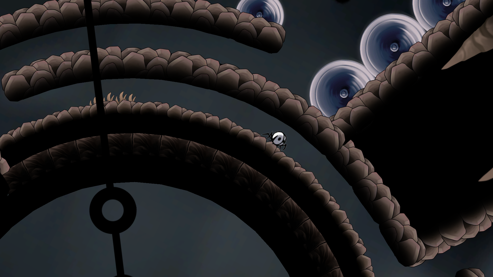
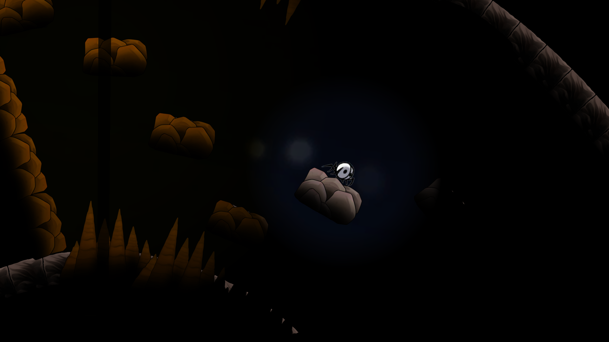
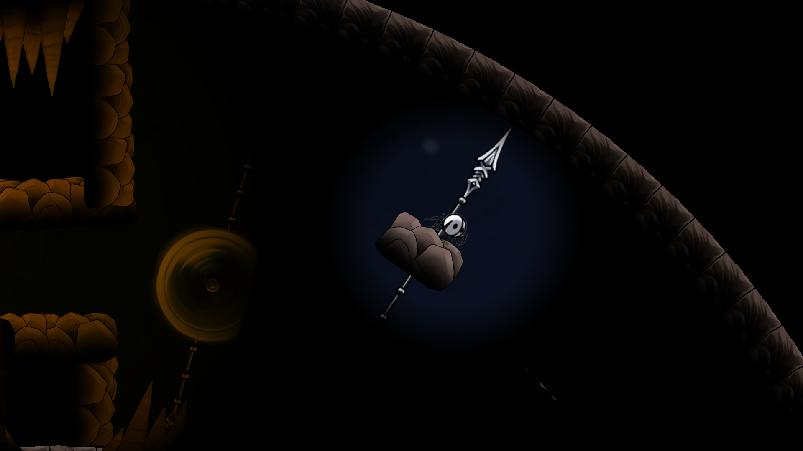
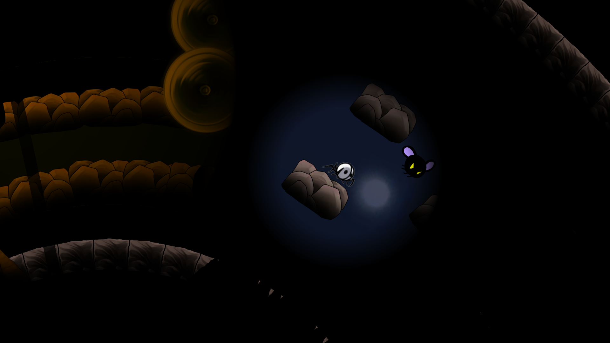

**Running out of Time - A project for CS427 Mid-term**

A little spider get stuck inside a clock cave. He is desperated to escape from the seconds hand ticking every seconds.
Help him find the way out of the maze. Be careful! There are a lot of "tricky" obstacles stand on his way.

**Menu UI**

**Level 1: Deadly Cave**
Basic level for player to get used to the movement of rounded map.

**Level 2: Stone Cold**
As deadly as the cold of ice.

**Level 3: Fog of War**
You never know what is going to happen..

**Contributor**

**Play on WebGL**: [Running out of time](https://bannnn511.itch.io/running-out-of-time)

**Install on PC (Windows only)**: [Running out of time](http://www.mediafire.com/file/lz660d76kspujr1/file)

**Unity Version**
Unity 2019.4.1f1

**Team member**
- Nguyen Minh Hieu - 1751067
- Ha Binh An - 1751047
- Luong The Van - 1751122
